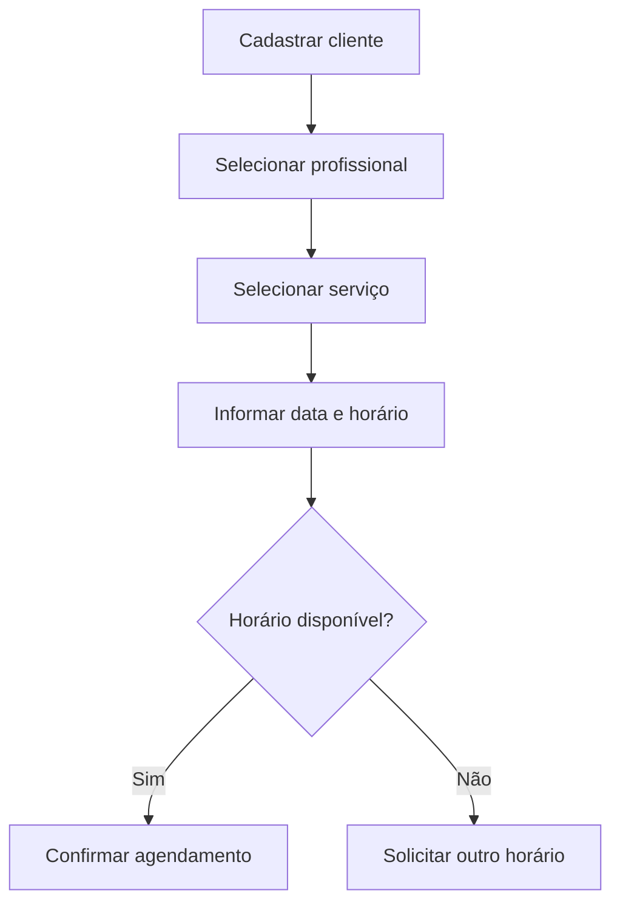
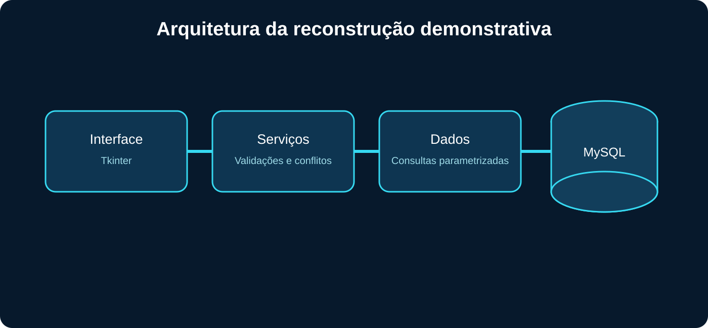
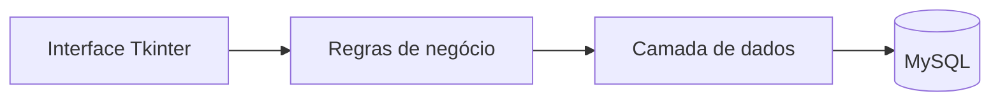
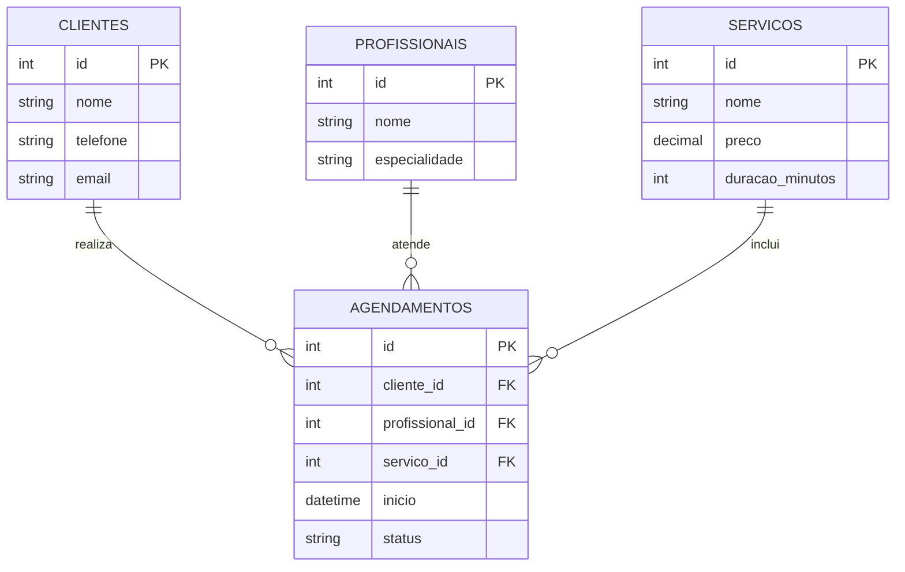
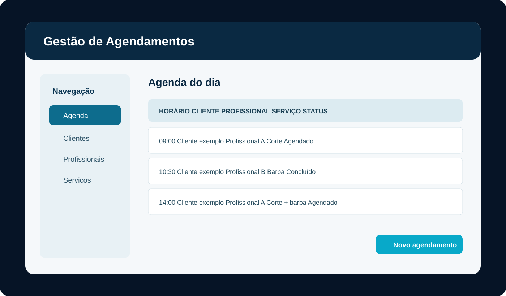

<p align="center"></p>

# Sistema Inteligente de Gestão de Agendamentos

Sistema desenvolvido para organizar clientes, profissionais, serviços e horários de uma barbearia, reduzindo conflitos e centralizando informações operacionais.

## Problema

Agendamentos registrados manualmente ficam sujeitos a conflitos de horário, perda de informações, dificuldade de consulta e pouca visibilidade sobre a rotina do estabelecimento.

## Objetivo

Centralizar o cadastro de clientes, profissionais e serviços, organizar a agenda e impedir que um profissional receba dois atendimentos no mesmo horário.

## Projeto original

O projeto original foi desenvolvido para uma barbearia utilizando **Python**, **MySQL**, **Figma** e **Visual Studio**. O Figma apoiou a criação e organização das interfaces, enquanto Python e MySQL foram utilizados na aplicação e na persistência dos dados.

Como os arquivos originais não estão mais disponíveis, a implementação publicada neste repositório é uma reconstrução funcional criada em 2026, preservando o propósito e as principais tecnologias do sistema.

## Solução

A aplicação utiliza uma interface desktop em Python, regras de negócio separadas e persistência em MySQL. O sistema valida os dados antes de cadastrar o atendimento e consulta a agenda para evitar conflitos.



## Funcionalidades reconstruídas

- cadastro e consulta de clientes;
- cadastro e consulta de profissionais;
- cadastro de serviços e valores;
- criação de agendamentos;
- validação de campos obrigatórios;
- prevenção de conflito de horário por profissional;
- listagem da agenda com cliente, profissional, serviço e status;
- cancelamento lógico de agendamentos;
- estrutura preparada para filtros e relatórios.

## Arquitetura





## Modelo de dados



## Tecnologias

- Python 3.11+
- Tkinter
- MySQL
- SQL
- mysql-connector-python
- Figma — prototipação do projeto original
- Visual Studio — ambiente utilizado no projeto original
- unittest
- GitHub Actions

O projeto não utiliza inteligência artificial. O termo “inteligente” está relacionado às validações e à prevenção automática de conflitos.

## Demonstração visual



O mockup representa a interface reconstruída e não é uma captura da versão original de 2024.

## Como executar

### 1. Preparar o ambiente

```bash
python -m venv .venv

# Windows
.venv\Scripts\activate

pip install -r requirements.txt
```

### 2. Criar o banco

Execute `database/schema.sql` no MySQL.

### 3. Configurar o acesso

Copie `.env.example` para `.env` e preencha apenas no ambiente local:

```env
DB_HOST=localhost
DB_PORT=3306
DB_USER=
DB_PASSWORD=
DB_NAME=gestao_agendamentos
```

### 4. Iniciar

```bash
python src/app.py
```

## Testes

```bash
python -m unittest discover -s tests -v
```

Os testes verificam validação de dados, status permitidos e conflito de horários sem exigir conexão com o banco.

## Organização

```text
├── .github/workflows/        # validação automática
├── assets/                   # capa, arquitetura e mockup
├── database/schema.sql       # estrutura do MySQL
├── docs/                     # documentação complementar
├── src/
│   ├── app.py                # interface desktop
│   ├── database.py           # conexão e consultas
│   └── services.py           # validações e regras
├── tests/                    # testes automatizados
├── .env.example
├── requirements.txt
└── README.md
```

## Segurança e qualidade

- credenciais não são versionadas;
- consultas recebem parâmetros separados dos comandos SQL;
- cancelamentos preservam o histórico;
- entradas são validadas antes da persistência;
- a CI executa testes e verifica a sintaxe do código.

## Limitações

- a implementação publicada é uma reconstrução funcional, não o código original;
- interface voltada a uso local;
- sem autenticação ou níveis de acesso;
- sem notificações automáticas;
- exige um servidor MySQL configurado localmente.

## Melhorias futuras

- autenticação e perfis de acesso;
- edição completa dos cadastros;
- filtros por período e profissional;
- notificações de confirmação;
- relatórios e indicadores operacionais;
- API e versão web responsiva;
- testes de integração com MySQL.

## Competências desenvolvidas

Python, SQL, modelagem de dados, regras de negócio, engenharia de software, experiência do usuário, testes e documentação técnica.

## Autor

**Sandro Ferreira**

[LinkedIn](https://www.linkedin.com/in/sandrozdb/) · [GitHub](https://github.com/sandrozdb)

## Licença

Distribuído sob a licença MIT. Consulte [LICENSE](LICENSE).
